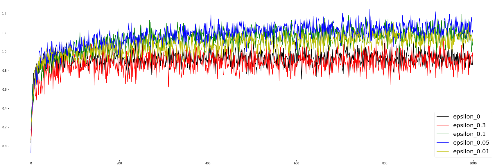
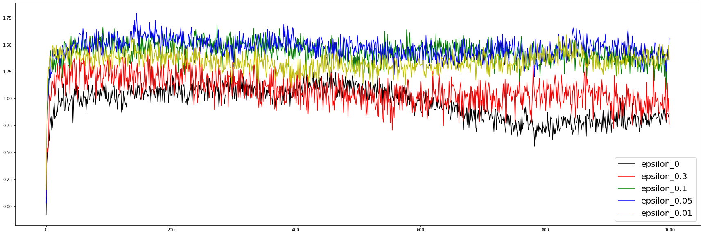
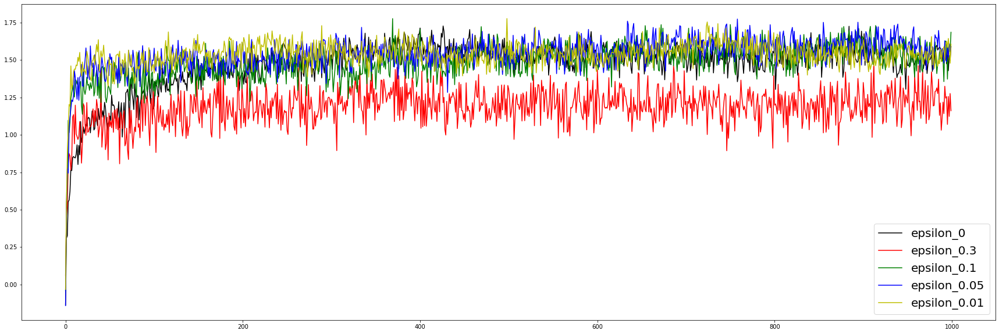

# Chapter2

my blog : https://roboharco12.tistory.com/54

Stationary 상황에서,   
epsilon 값에 따른 학습 추이 

   
   

Nonstationary 상황에서      
현재와 과거에대한 가중치가 동일한 표본 평균방법(Sample-average method)과    
    
     
    

과거의 가중치는 작게, 현재의 가중치는 크게 설정한    
고정된 시간간격 방법(Constant Step-Size Parameter method)
    

Nonstationary 상황에서는 표본평균 방법을 쓰기가 더 어려운 것을 확인할 수 있음.